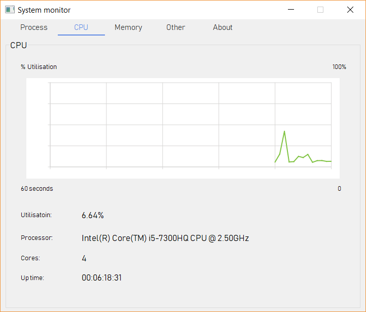
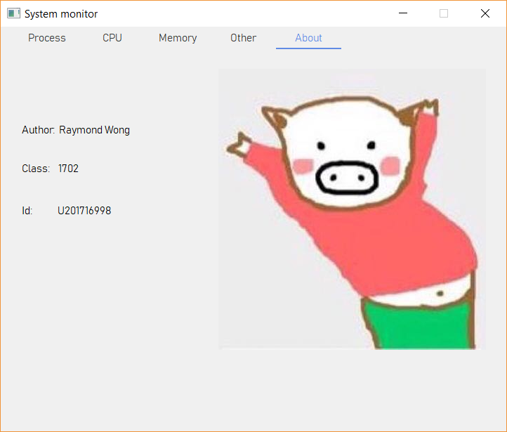

# System Monitor
HUST Opeating System course homework in 2019 summer

The system monitor app is written in C++ and developed on Qt Creator

The app acquires and shows some basic device information

## Compile environment
* Windows 10 x86
* Qt 5.11.2 MinGW 32bit

## functions
* Display process information, enabling to search to kill process
* Show CPU utilisation and basic parameters. The utilisation is shwon through dynamic line chart
* Show memory utilisation through dynamic line chart
* Show basic system information
* Show disk utilisation

informations are acquired through WIN32 API

    &nbsp;&nbsp;&nbsp;&nbsp;&nbsp;&nbsp;&nbsp;&nbsp;

